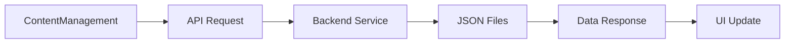
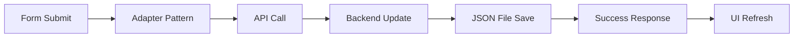

# 🗄️ VERİTABANI ENTEGRASYONU DÖKÜMANTASYONU

## 📋 GENEL BAKIŞ

ContentManagement sayfasındaki tüm değişiklikler artık backend'e otomatik olarak kaydediliyor. Sayfa yenilendiğinde veriler kaybolmuyor, JSON dosyalarında kalıcı olarak saklanıyor.

## 🏗️ MİMARİ YAPISI

### Backend (ASP.NET Core)
```
be/
├── Controllers/
│   └── ContentController.cs     # 🎮 API Endpoints
├── Services/
│   └── ContentService.cs        # 🔧 JSON Dosya İşlemleri  
├── Models/
│   └── ContentModels.cs         # 📝 Veri Modelleri
├── Data/                        # 📁 JSON Veritabanı
│   ├── hero.json               # 🎯 Hero Verisi
│   ├── skills.json             # 💪 Yetenekler Verisi
│   ├── career.json             # 💼 Kariyer Verisi
│   └── admin-settings.json     # ⚙️ Admin Ayarları
└── Program.cs                  # 🚀 Backend Başlatma
```

### Frontend (Next.js + React)
```
fe/src/
├── services/
│   └── contentApi.ts           # 🌐 API İletişim Servisi
├── components/layout/
│   ├── ContentManagement.tsx   # 🎛️ Ana Yönetim Component'i
│   └── ContentManagementLayout.tsx # 📋 UI Forms Layout
└── types/
    └── content.ts              # 📝 TypeScript Type Tanımları
```

## 🔄 VERİ AKIŞI

### 1. Sayfa Açılışı


### 2. Veri Güncelleme


## 🎯 API ENDPOINTS

### Hero Section
```typescript
GET    /api/content/hero          // Hero verisi getir
PUT    /api/content/hero          // Hero verisi güncelle
```

### Skills Section  
```typescript
GET    /api/content/skills        // Tüm yetenekleri getir
POST   /api/content/skills        // Yeni yetenek ekle
PUT    /api/content/skills/{id}   // Yetenek güncelle
DELETE /api/content/skills/{id}   // Yetenek sil
```

### Career Section
```typescript
GET    /api/content/career        // Tüm kariyer deneyimleri getir
POST   /api/content/career        // Yeni kariyer ekle  
PUT    /api/content/career/{id}   // Kariyer güncelle
DELETE /api/content/career/{id}   // Kariyer sil
```

### Admin Settings
```typescript
GET    /api/content/admin-settings    // Admin ayarları getir
PUT    /api/content/admin-settings    // Admin ayarları güncelle
```

## 🔧 ADAPTER PATTERN KULLANIMI

API türleri ile frontend türleri arasında uyumluluk için adapter pattern kullanılmıştır:

### API → Frontend Dönüşümü
```typescript
const convertApiDataToContentData = (
    heroData: ApiHeroData,
    skillsData: ApiSkillData[],
    careerData: ApiCareerData[]
): Partial<ContentData> => {
    return {
        heroSection: {
            title: heroData.title,
            text: heroData.text,
            imageUrl: heroData.imageUrl,
            position: heroData.position,
            areaNumber: heroData.areaNumber
        },
        skills: skillsData.map(skill => ({
            id: skill.id,
            name: skill.name,
            proficiency: skill.proficiency
        })),
        career: careerData.map(career => ({
            id: career.id,
            company: career.company,
            position: career.position,
            startDate: career.startDate,
            endDate: career.endDate,
            description: career.description,
            logoUrl: career.logoUrl,
            location: career.location,
            workType: career.workType,
            lastUpdated: career.lastUpdated || new Date().toISOString()
        }))
    };
};
```

### Frontend → API Dönüşümü
```typescript
const convertContentDataToApiData = (data: Partial<ContentData>) => {
    const result = {};

    if (data.heroSection) {
        result.hero = {
            id: 'hero-1',
            title: data.heroSection.title,
            text: data.heroSection.text,
            imageUrl: data.heroSection.imageUrl,
            position: data.heroSection.position,
            areaNumber: data.heroSection.areaNumber
        };
    }

    if (data.skills) {
        result.skills = data.skills.map(skill => ({
            id: skill.id,
            name: skill.name,
            proficiency: skill.proficiency,
            category: 'General' // Backend için gerekli
        }));
    }

    // ... career mapping
    
    return result;
};
```

## 🚀 ÇALIŞTIRMA TALİMATLARI

### 1. Backend'i Başlat
```bash
cd be
dotnet run --urls="http://localhost:5000"
```

### 2. Frontend'i Başlat
```bash
cd fe  
npm run dev
```

### 3. ContentManagement Sayfasını Aç
```
http://localhost:3000/admin
```

## 📋 ÖZELLİKLER

### ✅ Çalışan Özellikler
- 🎯 **Hero Section**: Başlık, açıklama, resim, pozisyon güncelleme
- 💪 **Skills Management**: Yetenek ekleme, silme, yetkinlik ayarlama  
- 💼 **Career Display**: Kariyer deneyimlerini listeleme ve silme
- 🔄 **Real-time Sync**: Her değişiklik anında backend'e kaydediliyor
- 💾 **Persistent Storage**: Sayfa yenilense de veriler korunuyor
- ⚠️ **Error Handling**: API hatalarında kullanıcı dostu mesajlar
- 🔄 **Loading States**: İşlem sırasında loading göstergesi

### 🔜 Gelecek Özellikler
- 🚀 **Projects Management**: Proje ekleme/düzenleme/silme
- 📞 **Contact Management**: İletişim bilgileri ve sosyal medya
- 🎨 **Image Upload**: Resim yükleme sistemi
- 📊 **Analytics**: Veri kullanım istatistikleri

## 🗂️ JSON DOSYA YAPILARI

### hero.json
```json
{
  "id": "hero-1",
  "title": "Merhaba, Ben John Doe", 
  "text": "Full Stack Developer...",
  "imageUrl": "https://example.com/image.jpg",
  "position": "left",
  "areaNumber": 1,
  "lastUpdated": "2024-01-15T10:30:00.000Z"
}
```

### skills.json
```json
[
  {
    "id": "skill-1",
    "name": "React",
    "proficiency": 90,
    "category": "Frontend",
    "lastUpdated": "2024-01-15T10:30:00.000Z"
  }
]
```

### career.json
```json
[
  {
    "id": "career-1", 
    "company": "TechCorp A.Ş.",
    "position": "Senior Frontend Developer",
    "startDate": "Ocak 2022",
    "endDate": "Devam Ediyor",
    "description": "React ve TypeScript...",
    "logoUrl": "https://example.com/logo.png",
    "location": "İstanbul",
    "workType": "Tam Zamanlı",
    "lastUpdated": "2024-01-15T10:30:00.000Z"
  }
]
```

## 🔧 SORUN GİDERME

### Backend Bağlantı Hatası
```
✅ Backend'in çalıştığından emin olun: http://localhost:5000
✅ CORS ayarlarının doğru olduğunu kontrol edin
✅ API URL'nin doğru olduğunu kontrol edin (contentApi.ts)
```

### Veri Kaybolma Sorunu
```
✅ be/Data klasörünün yazma izinlerini kontrol edin
✅ JSON dosyalarının bozulmadığından emin olun
✅ Backend log'larını kontrol edin
```

### Type Hataları
```
✅ API types ile ContentData types arasında adapter pattern kullanın
✅ TypeScript strict mode ayarlarını kontrol edin
✅ Import statement'ları doğru olduğundan emin olun
```

## 🎯 BAŞARILI TEST SENARYOSU

1. **Backend'i başlat** → ✅ http://localhost:5000 çalışıyor
2. **Frontend'i başlat** → ✅ http://localhost:3000 çalışıyor  
3. **Admin sayfasını aç** → ✅ /admin sayfası yükleniyor
4. **Hero verisi güncelle** → ✅ Değişiklik kaydediliyor
5. **Yeni skill ekle** → ✅ Liste güncelleniyor
6. **Sayfayı yenile** → ✅ Veriler korunuyor
7. **Backend Data klasörünü kontrol et** → ✅ JSON dosyaları güncellenmiş

## 🏆 BAŞARIYLA TAMAMLANDI!

Artık ContentManagement sayfasındaki tüm değişiklikler backend'e kaydediliyor ve sayfa yenilendiğinde veriler kaybolmuyor! 🎉 